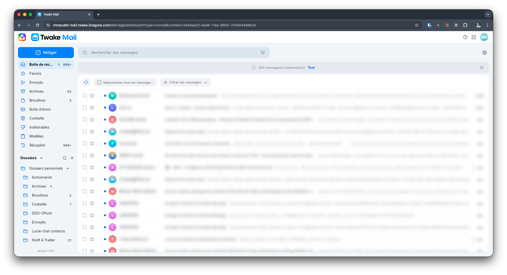

# mcp-twake-mail

[](LICENSE)
[](https://nodejs.org/)

**MCP server for [Twake.ai](https://www.twake.ai/) — integrate your sovereign JMAP email server with any MCP-compatible AI assistant**



## Overview

mcp-twake-mail is a Model Context Protocol (MCP) server that connects any MCP-compatible AI assistant (Claude Desktop, Claude Code, etc.) to your JMAP email server. Compatible with JMAP-compliant servers including Apache James, Cyrus IMAP, and other RFC 8620/8621 implementations.

**Key benefits:**
- Your data stays on your own servers — sovereign infrastructure
- Works with any MCP-compatible AI assistant
- Full control over email data — read, write, send, and organize
- Multiple authentication methods: Basic, Bearer token, or OIDC
- Secure HTTPS-only connections

## Features

**Email Read Tools:**
- `list_emails` - List emails with filtering, search, and pagination
- `get_email` - Get full email content including body and headers
- `search_emails` - Search emails by keywords
- `get_thread` - Get all emails in a conversation thread

**Email Compose Tools:**
- `send_email` - Compose and send a new email (plain text and/or HTML)
- `reply_email` - Reply to an email with proper threading (In-Reply-To, References)
- `create_draft` - Create a draft email for later editing or sending

**Email Management Tools:**
- `mark_as_read` - Mark an email as read
- `mark_as_unread` - Mark an email as unread
- `delete_email` - Move to trash or permanently delete
- `move_email` - Move an email to a different mailbox
- `add_label` - Add a label/mailbox to an email
- `remove_label` - Remove a label/mailbox from an email

**Mailbox Tools:**
- `list_mailboxes` - List all mailboxes (Inbox, Sent, Drafts, etc.)

**Attachment Tools:**
- `get_attachments` - List attachment metadata for an email
- `download_attachment` - Download attachment content (auto-saves large files to disk)

**Advanced Features:**
- OIDC authentication with PKCE (S256) for enterprise SSO
- Automatic token refresh for OIDC sessions
- Thread-based email grouping
- Inline vs regular attachment detection
- Large attachment handling (auto-saves to ~/Downloads for files > 750KB)
- MCP tool annotations (readOnlyHint, destructiveHint, idempotentHint)

## Prerequisites

- **Node.js** >= 20.0.0
- **JMAP Server** - A JMAP-compliant email server such as:
  - Apache James
  - Cyrus IMAP
  - Stalwart Mail Server
  - Fastmail
- **MCP-compatible AI assistant** - Claude Desktop, Claude Code, or any MCP client

## Installation

**From source:**
```bash
git clone https://github.com/linagora/mcp-twake-mail.git
cd mcp-twake-mail
npm install
npm run build
```

## Quick Setup (Recommended)

The easiest way to configure mcp-twake-mail is to use the interactive setup wizard:

```bash
npx mcp-twake-mail setup
```

The wizard will:
1. Ask for your JMAP server session URL
2. Ask for your authentication method (Basic, Bearer, or OIDC)
3. Collect the required credentials
4. Test the connection to your JMAP server
5. Generate and optionally write the configuration to your Claude Desktop config file

Example session:
```
=== MCP Twake Mail Setup Wizard ===

JMAP Session URL: https://jmap.example.com/jmap/session

Authentication method:
  1. Basic (username/password)
  2. Bearer token (JWT)
  3. OIDC (OpenID Connect)
Choose [1-3]: 1

Username: user@example.com
Password: ********

Testing connection...
Connected! Account ID: abc123

Server name for Claude config [twake-mail]: twake-mail

--- Generated Claude Desktop Config ---
{
  "mcpServers": {
    "twake-mail": {
      "command": "npx",
      "args": ["-y", "mcp-twake-mail"],
      "env": {
        "JMAP_SESSION_URL": "https://jmap.example.com/jmap/session",
        "JMAP_AUTH_METHOD": "basic",
        "JMAP_USERNAME": "user@example.com",
        "JMAP_PASSWORD": "********"
      }
    }
  }
}
---------------------------------------

Write to Claude Desktop config? [Y/n]: y

Config written successfully!
Restart Claude Desktop to load the new configuration.
```

### CLI Commands

| Command | Description |
|---------|-------------|
| `mcp-twake-mail` | Start MCP server (default) |
| `mcp-twake-mail setup` | Interactive configuration wizard |
| `mcp-twake-mail auth` | Re-run OIDC authentication flow |
| `mcp-twake-mail check` | Verify configuration and test connection |

## Configuration

### Environment Variables

#### Basic Auth

| Variable | Required | Description | Example |
|----------|----------|-------------|---------|
| `JMAP_SESSION_URL` | Yes | JMAP session endpoint URL | `https://jmap.example.com/jmap/session` |
| `JMAP_AUTH_METHOD` | No | Set to `basic` (default) | `basic` |
| `JMAP_USERNAME` | Yes | Username for authentication | `user@example.com` |
| `JMAP_PASSWORD` | Yes | Password for authentication | `your-password` |

#### Bearer Token

| Variable | Required | Description | Example |
|----------|----------|-------------|---------|
| `JMAP_SESSION_URL` | Yes | JMAP session endpoint URL | `https://jmap.example.com/jmap/session` |
| `JMAP_AUTH_METHOD` | Yes | Must be set to `bearer` | `bearer` |
| `JMAP_TOKEN` | Yes | JWT Bearer token | `eyJhbGciOiJSUzI1NiIs...` |

#### OIDC Authentication

For enterprise SSO with OpenID Connect (PKCE S256):

| Variable | Required | Description | Example |
|----------|----------|-------------|---------|
| `JMAP_SESSION_URL` | Yes | JMAP session endpoint URL | `https://jmap.example.com/jmap/session` |
| `JMAP_AUTH_METHOD` | Yes | Must be set to `oidc` | `oidc` |
| `JMAP_OIDC_ISSUER` | Yes | OIDC provider issuer URL | `https://sso.example.com` |
| `JMAP_OIDC_CLIENT_ID` | Yes | OIDC client ID | `my-client-id` |
| `JMAP_OIDC_SCOPE` | No | OIDC scopes | `openid profile email offline_access` |
| `JMAP_OIDC_REDIRECT_URI` | No | Callback URI for OIDC flow | `http://localhost:5678/callback` |

#### Optional

| Variable | Description | Default |
|----------|-------------|---------|
| `LOG_LEVEL` | Log verbosity: `fatal`, `error`, `warn`, `info`, `debug`, `trace` | `info` |
| `JMAP_REQUEST_TIMEOUT` | Request timeout in milliseconds | `30000` |

### Claude Desktop Configuration

Add the following to your Claude Desktop configuration file:

**Configuration file location:**
- **macOS:** `~/Library/Application Support/Claude/claude_desktop_config.json`
- **Linux:** `~/.config/Claude/claude_desktop_config.json`
- **Windows:** `%APPDATA%\Claude\claude_desktop_config.json`

**Configuration (Basic Auth):**

```json
{
  "mcpServers": {
    "twake-mail": {
      "command": "node",
      "args": ["/path/to/mcp-twake-mail/build/index.js"],
      "env": {
        "JMAP_SESSION_URL": "https://jmap.example.com/jmap/session",
        "JMAP_AUTH_METHOD": "basic",
        "JMAP_USERNAME": "user@example.com",
        "JMAP_PASSWORD": "your-password"
      }
    }
  }
}
```

**Configuration (OIDC):**

```json
{
  "mcpServers": {
    "twake-mail": {
      "command": "node",
      "args": ["/path/to/mcp-twake-mail/build/index.js"],
      "env": {
        "JMAP_SESSION_URL": "https://jmap.example.com/jmap/session",
        "JMAP_AUTH_METHOD": "oidc",
        "JMAP_OIDC_ISSUER": "https://sso.example.com",
        "JMAP_OIDC_CLIENT_ID": "my-client-id",
        "JMAP_OIDC_SCOPE": "openid profile email offline_access",
        "JMAP_OIDC_REDIRECT_URI": "http://localhost:5678/callback"
      }
    }
  }
}
```

After updating the configuration, restart Claude Desktop for changes to take effect.

## Usage Examples

Once configured, you can ask Claude natural language questions about your email:

**Email queries:**
- "What are my unread emails?"
- "Show me emails from Pierre"
- "What's the latest email in my inbox?"
- "Find emails about the budget meeting"
- "Show the conversation thread for this email"

**Email composition:**
- "Send an email to pierre@example.com about the meeting tomorrow"
- "Reply to this email thanking them for the information"
- "Create a draft email to the team about the project update"

**Email management:**
- "Mark this email as read"
- "Move this email to the Archive folder"
- "Delete all spam emails"
- "Add the 'Important' label to this email"

**Attachments:**
- "What attachments are in this email?"
- "Download the PDF attachment"

## Available Tools

| Tool Name | Description |
|-----------|-------------|
| `list_emails` | List emails with optional filters (mailbox, limit, search) |
| `get_email` | Get full email content by ID |
| `search_emails` | Search emails by keywords |
| `get_thread` | Get all emails in a thread |
| `send_email` | Send a new email |
| `reply_email` | Reply to an email with threading |
| `create_draft` | Create a draft email |
| `mark_as_read` | Mark email as read |
| `mark_as_unread` | Mark email as unread |
| `delete_email` | Delete or trash an email |
| `move_email` | Move email to another mailbox |
| `add_label` | Add mailbox/label to email |
| `remove_label` | Remove mailbox/label from email |
| `list_mailboxes` | List all mailboxes |
| `get_attachments` | List attachment metadata |
| `download_attachment` | Download attachment content |

## Development

```bash
git clone https://github.com/linagora/mcp-twake-mail.git
cd mcp-twake-mail
npm install
npm run build    # compile TypeScript
npm test         # run tests
npm run dev      # watch mode (auto-rebuild on file changes)
```

The server uses the MCP stdio transport and communicates via JSON-RPC on stdin/stdout.

## Architecture

mcp-twake-mail is built with a layered architecture:

1. **Configuration Layer** - Zod-based environment variable validation with fail-fast behavior
2. **Logging Layer** - Pino logger configured for stderr output (prevents stdout contamination in MCP stdio transport)
3. **Authentication Layer** - Multi-method auth support (Basic, Bearer, OIDC with PKCE)
4. **Token Management** - Automatic token refresh for OIDC with secure token storage
5. **JMAP Client Layer** - Session management, request batching, blob download support
6. **Transformation Layer** - Email/Mailbox data transformation for AI-friendly output
7. **MCP Tool Layer** - 16 MCP tools exposing email functionality with tool annotations
8. **Entry Point** - MCP server initialization with stdio transport

**Key design decisions:**
- ESM modules with `.js` import extensions (required by MCP SDK)
- JMAP RFC 8620/8621 compliance for broad server compatibility
- AI-friendly error formatting for troubleshooting
- Large attachment handling (auto-save to disk for files > 750KB)
- MCP tool annotations for AI clients (readOnlyHint, destructiveHint, idempotentHint)

## License

This project is licensed under the **GNU Affero General Public License v3.0 (AGPL-3.0)**.

See the [LICENSE](LICENSE) file for details.

**Copyright (c) 2026 LINAGORA** <https://linagora.com>

## Contributing

Contributions are welcome! Please read our [Contributing Guidelines](CONTRIBUTING.md) for details on the development workflow, code style, and pull request process.

## Support

For issues, questions, or feature requests, please open an issue on the GitHub repository.

For commercial support or inquiries, contact LINAGORA at <https://linagora.com>.
